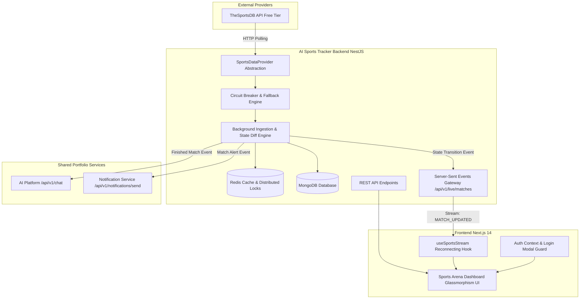

# 🏆 AI Sports Tracker

> **Production-Grade Real-Time Sports Telemetry & AI Tactical Debrief Platform**  
> *Second Domain Application in the AI Engineering Portfolio*

[](https://github.com/rishank-kesarwani/ai-sports-tracker/actions)
[](https://opensource.org/licenses/MIT)
[](https://www.typescriptlang.org/)
[](https://nestjs.com/)
[](https://nextjs.org/)
[](https://redis.io/)

---

## 🌟 Overview & Architecture

**AI Sports Tracker** is a production-grade full-stack web application designed for sports enthusiasts and quantitative analysts. It provides **near-real-time live score updates**, **minute-by-minute telemetry**, **league table standings**, and **grounded tactical match debriefs** across **Football (Soccer), Cricket, Basketball, and Tennis**.

Built as part of a multi-service engineering portfolio, the system strictly separates domain logic from shared platform concerns:
1. **[AI Platform](https://github.com/rishank-kesarwani/ai-platform)**: Consumed via resilient HTTP client for grounded match recaps, player comparisons, and conversational AI assistance without duplicating LLM infrastructure.
2. **[Notification Service](https://github.com/rishank-kesarwani/notification-service)**: Consumed via asynchronous client with idempotency keys for match start alerts, full-time score summaries, and weekly digests across Email and Push channels.
3. **[AI Travel Planner](https://github.com/rishank-kesarwani/ai-travel-planner)**: Reference architecture adhering to production authentication, refresh token rotation, centralized error envelopes, and circuit-breaker resilience.



---

## ⚡ Data Freshness & Near-Real-Time Semantics

To avoid misrepresenting data speeds on free-tier APIs, the application explicitly tags every match and telemetry feed with one of three freshness tiers:

| Tier | Freshness Tag | Description | Typical Latency |
| :--- | :--- | :--- | :--- |
| 🔴 **Live** | `live` | Actively streamed directly from socket / sub-second telemetry feeds. | `< 1s` |
| 🔵 **Near-Real-Time** | `near-real-time` | Ingested via scheduled provider polling and broadcast through Server-Sent Events (SSE). | `10s - 30s` |
| ⚪ **Cached** | `cached` | Historical results, future fixtures, and league standings stored in Redis. | `1m - 6h` |

---

## 🔄 Real-Time & Event-Driven Subsystems

### 1. Server-Sent Events (SSE) Streaming
- **Endpoint**: `GET /api/v1/live/matches?sport={sport}&leagueId={leagueId}`
- **Heartbeat Ping**: Dispatches `:keep-alive` every **15 seconds** to prevent reverse-proxy timeouts.
- **Event Types**:
  - `MATCH_UPDATED`: Minute progression, live statistics.
  - `SCORE_CHANGE`: Goal, wicket, or basket recorded.
  - `MATCH_STATUS_CHANGE`: Transition from `SCHEDULED` $\rightarrow$ `LIVE` $\rightarrow$ `FINISHED`.
- **Frontend Hook**: `useSportsStream()` features automatic reconnection with exponential backoff (1s, 2s, 4s up to 30s) and connection status telemetry.

### 2. Ingestion & State Diff Detection
- Distributed locks via Redis (`sports:lock:ingestion:sync:job`) prevent duplicate sync runs across multi-instance backend containers.
- Detects score and status changes by comparing current provider telemetry with `sports:ingestion:prev:{matchId}`.
- Triggers automated post-match AI recaps and notification dispatch upon `FINISHED` status transition.

---

## 🧠 AI Platform Integration (Shared Service)

All LLM capabilities are delegated to the shared **AI Platform** service with **grounded prompt engineering**:

```typescript
// Example: Delegated AI Match Recap
const prompt = `
Analyze the verified match telemetry below:
- Home: ${match.homeTeam.name} (${match.homeTeam.score})
- Away: ${match.awayTeam.name} (${match.awayTeam.score})
- Events: ${JSON.stringify(match.events)}
CRITICAL: Do not hallucinate statistics. Only refer to verified data.
`;
const response = await aiPlatformClient.generateCompletion({ prompt });
```

### AI Features:
- **Conversational Sports Assistant (`/ai-assistant`)**: Natural language queries such as *"What are Arsenal's next fixtures?"* or *"Compare Haaland and Saka"*.
- **Match Intelligence**: Instant tactical summaries with possession and transition analysis.
- **Scout Assessments**: Side-by-side athlete comparison radars.
- **Resilient Fallback**: Rule-based tactical analyzer activates seamlessly if the AI Platform is temporarily unreachable.

---

## 🔔 Notification Service Integration (Shared Service)

Notifications are dispatched **asynchronously without blocking HTTP requests**:

- **Events**: `MATCH_STARTING`, `MATCH_RESULT`, `TEAM_UPDATE`, `PLAYER_UPDATE`, `WEEKLY_SPORTS_DIGEST`, `PASSWORD_RESET`.
- **Channels**: `IN_APP` (persisted in MongoDB), `EMAIL` (dispatched to shared notification service), `PUSH`.
- **Idempotency**: Requests carry `Idempotency-Key: notif-{userId}-{matchId}-{type}` preventing duplicate sends.

---

## 🗄️ Redis Caching Hierarchy

| Cache Key | TTL | Purpose | Stale-While-Revalidate |
| :--- | :--- | :--- | :--- |
| `sports:live:all` | `15s` | Current active live matches | Yes |
| `sports:match:{id}` | `30s` (Live) / `24h` (Finished) | Detailed match center telemetry | Yes |
| `sports:team:{id}` | `6h` | Team profile, stadium, and squad | Yes |
| `sports:league:{id}` | `12h` | Standings tables & tournament metadata | Yes |
| `sports:ai:summary:{id}` | `7d` | Grounded post-match AI analysis | Yes |
| `sports:lock:{name}` | `10s - 30s` | Distributed concurrency locks | N/A |

---

## 🛡️ Authentication & Production UX

- **JWT Tokens**: 15-minute access token + 7-day refresh token stored in `httpOnly`, `sameSite: strict` secure cookies.
- **Refresh Token Rotation**: Detects token reuse and automatically revokes compromised sessions.
- **Login Required UX**: Unauthenticated attempts to follow teams, save preferences, or chat with AI trigger a non-disruptive **Sign In Required Modal** rather than generic network errors.
- **Error Discrimination**: Standardized error envelope distinguishing `401`, `403`, `404`, `409`, `422`, `429`, `500`, and `Network Offline`.

---

## 🚀 Quick Start (Local Development)

### Prerequisites
- **Node.js**: `v20+` or `v22+`
- **Docker & Docker Compose**

### 1. Clone Repository
```bash
git clone https://github.com/rishank-kesarwani/ai-sports-tracker.git
cd ai-sports-tracker
```

### 2. Configure Environment Variables
```bash
cp .env.example .env
cp backend/.env.example backend/.env
cp frontend/.env.example frontend/.env.local
```

### 3. Run with Docker Compose
```bash
docker compose up --build
```

### 4. Or Run Manually in Development Mode

**Backend (NestJS):**
```bash
cd backend
npm install
npm run start:dev
# Running at http://localhost:4000/api/v1
# Swagger Docs at http://localhost:4000/api/docs
```

**Frontend (Next.js 14):**
```bash
cd frontend
npm install
npm run dev
# Running at http://localhost:3000
```

---

## 🧪 Testing Suite

Run full unit and integration test suites:

```bash
# Backend Test Suite (Jest)
cd backend
npm test

# Frontend TypeScript Typecheck
cd frontend
npm run typecheck
```

---

## 🌐 API Specification

Explore the interactive Swagger / OpenAPI specification by navigating to:
```
http://localhost:4000/api/docs
```

### Key Endpoints:
- `GET /api/v1/sports` - List supported sports
- `GET /api/v1/sports/leagues` - List tournaments & standings
- `GET /api/v1/sports/matches/live` - Fetch live scores
- `GET /api/v1/sports/matches/upcoming` - Fetch scheduled fixtures
- `GET /api/v1/live/matches` - **SSE Real-time match stream**
- `POST /api/v1/ai/chat` - Conversational AI Assistant
- `GET /api/v1/ai/match-summary/:id` - Grounded match debrief
- `POST /api/v1/follows/teams/:id` - Follow team
- `GET /api/v1/health` - Dependency health telemetry

---

## 🚢 Production Deployment

### Frontend (Vercel)
1. Import repository on [Vercel](https://vercel.com).
2. Set Root Directory to `frontend`.
3. Set Environment Variable: `NEXT_PUBLIC_API_URL=https://api.yourdomain.com/api/v1`.

### Backend & Redis (Railway)
1. Deploy `backend` service with Node.js Dockerfile on [Railway](https://railway.app).
2. Provision managed **MongoDB** and **Redis** on Railway.
3. Configure private network URLs:
   - `AI_PLATFORM_URL=http://ai-platform.railway.internal:4001`
   - `NOTIFICATION_SERVICE_URL=http://notification-service.railway.internal:4002`

---

## 📄 License
MIT License &copy; 2026 Rishank Kesarwani. Part of the AI Engineering Portfolio.
